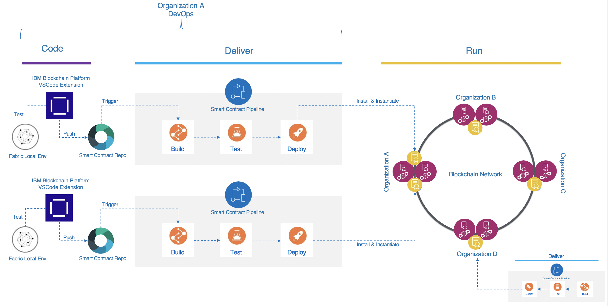
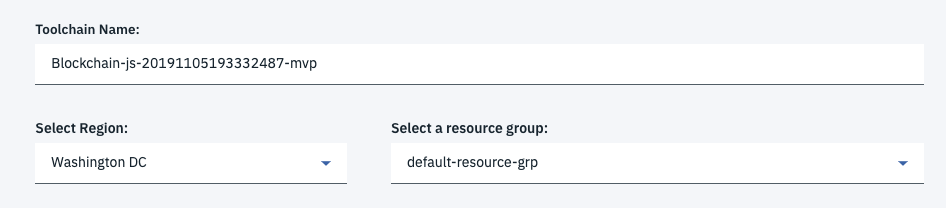
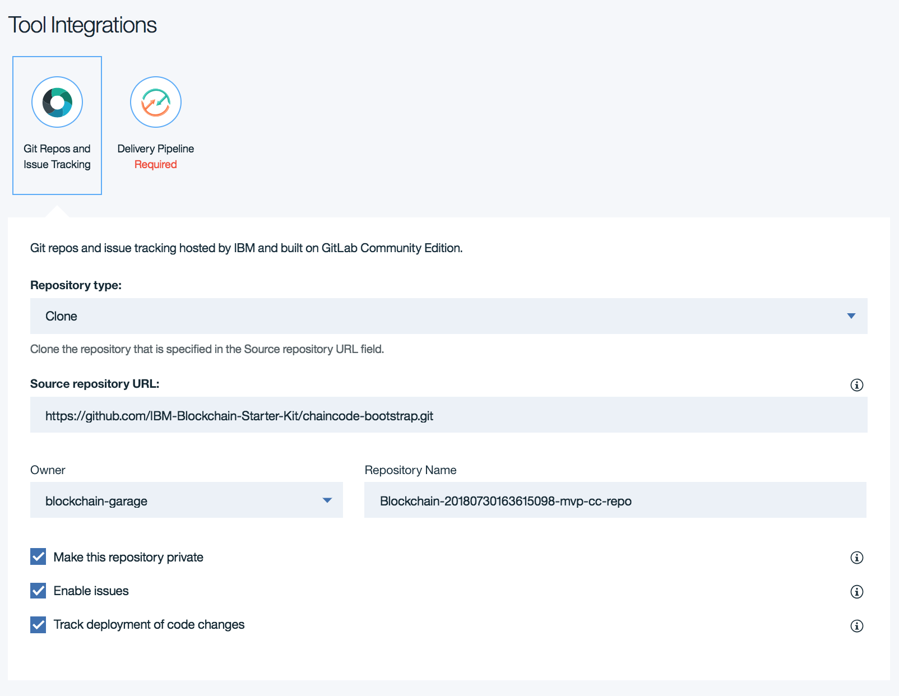
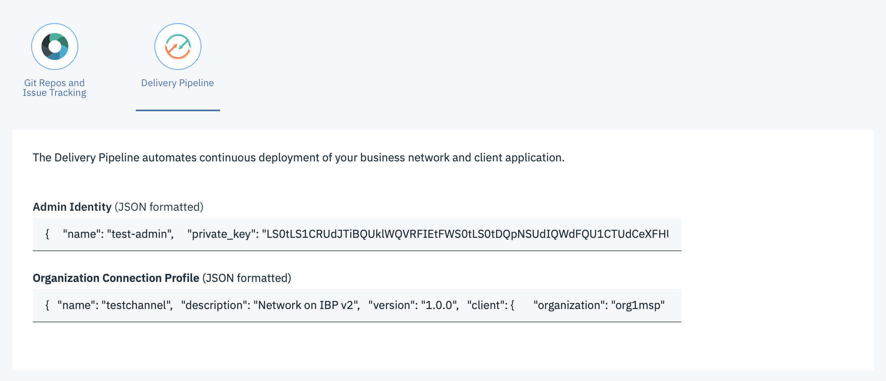

# Chaincode Toolchain Automation

This repository allows you to create a simple CI/CD pipeline for your Hyperledger Fabric chaincode using the Continuos Delivery Service on the IBM Cloud.  The pipeline supports building, unit testing and deploying smart contracts directly to the IBM Blockchain Platform.  Currently the pipeline support chaincode written in JavaScript, TypeScript and Go.  The following diagram provides an overview of the type of DevOps environment that can be created using this tool.

## Prerequisites

You will need an [IBM Cloud](https://cloud.ibm.com/) account that has permissions to create/provision new services. 

You will need an instance of the next generation [IBM Blockchain Platform](https://cloud.ibm.com/docs/services/blockchain?topic=blockchain-get-started-ibp) provisioned under your IBM Cloud account.

## How It Works

Upon clicking one of the [buttons](#choose-your-desired-platform) below, you will be redirected to an IBM Cloud [Toolchain](https://console.bluemix.net/docs/services/ContinuousDelivery/toolchains_about.html) creation page. If you are not already logged on to the IBM Cloud, you will need to do so. Once logged on and on the toolchain creation page, you will be prompted with a three-part form.

### Toolchain Setup

The first section of the form configures the name, the region, and the resource group for the toolchain. You should edit these fields as desired.

### Version and Issue Tracking

The second section of the form configures the GitLab repository to use. A scaffolding repository containing platform-specific bootstrapping code (i.e. Node.js vs. GoLang) is set up to be cloned into a GitLab repository with a corresponding issue tracker. You can edit these fields as desired.

### Continuous Integration Delivery Pipeline

The third section of the form is the configuration for the delivery pipeline. Here you provide the corresponding connection profile along with the Fabric identity/credentials [in JSON format] for installing the chaincode component onto the specified peers and instantiating on the specified channel. You can download both artifacts from your IBM Blockchain Platform instance. Make sure you have a Continuous Delivery service already defined under the chosen resource group (e.g. `default-resource-group`) and region (e.g. `us-east`).

Also, please note that you can also provide an array of values in the `Admin Identity` field and in the `Organization Connection Profile` fields. If doing so, please make sure that each admin credentials item in the first array matches the corresponding organization's connection profile item in the second array. Otherwise, you will get undesired behavior.

## Choose Your Desired Platform

|Platform|Language|One-Click Toolchain Creation||
|---------|----------|----------|----------|
| Fabric | JavaScript / TypeScript |  | [TypeScript Sample Chaincode](https://github.com/IBM-Blockchain-Starter-Kit/nodejs-chaincode-bootstrap/) |
| Fabric | GoLang |  | [GoLang Sample Chaincode](https://github.com/IBM-Blockchain-Starter-Kit/chaincode-bootstrap/) |
